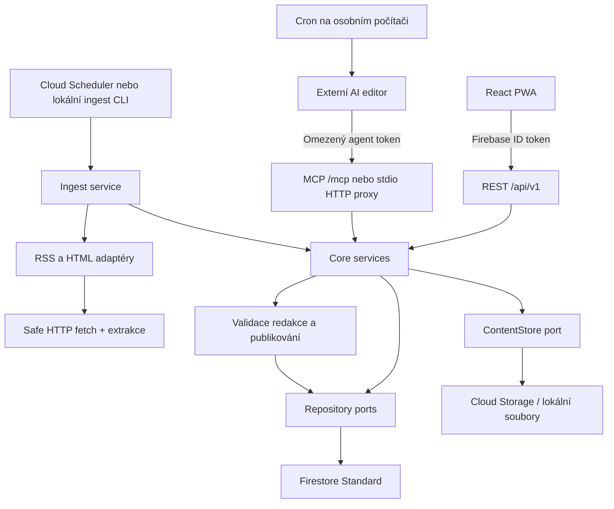

# Architektura

**Prototypová odbočka schváleným požadavkem na rychlé nasazení:** aktuální `apps/hosted` používá stejné core přes D1/R2 adaptéry a Sites identity. `packages/prototype-api` je Fetch handler nezávislý na UI. `packages/connectors` poskytuje registry ručních a RSS/Atom vstupů. Externí AI job má export/import JSON; HTTP knihovna je oddělená od konektorů. Následující Firebase návrh zůstává cílovou variantou, není popisem aktuálního hosted runtime. Viz [PROTOTYPE](PROTOTYPE.md).

## Závazný tvar

Modulární monolit. Node 24 LTS, TypeScript strict/ESM, pnpm workspace. React + Vite SPA, React Router, TanStack Query, IndexedDB přes `idb`, MiniSearch, vite-plugin-pwa. Fastify API; Firebase Admin adaptéry. Sdílené runtime kontrakty implementovat v Zod, typy odvodit z nich. MCP TypeScript SDK s podporou Streamable HTTP a stdio; přesné kompatibilní verze uzamknout v lockfile při implementaci.

## Balíčky a hranice

| Adresář | Odpovědnost | Povolené závislosti |
|---|---|---|
| apps/web | obrazovky, cache, Firebase client login | shared, veřejné HTTP API |
| apps/server | Fastify, auth middleware, dependency wiring, CLI | všechny backend balíčky |
| packages/shared | Zod schémata, DTO, error codes | Zod; žádné síťové SDK |
| packages/core | ingest orchestrace, prefilter, runs, publish, feedback | shared a vlastní ports |
| packages/connectors | safe fetch, RSS, HTML list/detail, Readability | shared, core ports, parsovací knihovny |
| packages/storage | Firestore repository, GCS/local ContentStore, test memory store | core/shared, Firebase Admin |
| packages/mcp | tool definitions a transport adaptéry | shared, core service interfaces, MCP SDK |
| docs/contracts | normativní návrh smluv a příklady | žádná produkční implementace |

Core dostává explicitní `Principal`, `Clock`, `IdGenerator`, repository a ContentStore. Žádné singletony Firebase v business logice. Neabstrahovat každý databázový dotaz; repository má operace potřebné use-cases, včetně atomického publish a idempotentního ingestu.

## Deploy a identity

Firebase Hosting servíruje web a přeposílá `/api/**` a `/mcp` do Cloud Run ve stejném regionu jako databáze/storage. Cloud Run je veřejně dosažitelný, ale každý datový endpoint ověřuje identity v aplikaci. Nikdy nedůvěřovat tomu, že request prošel přes Hosting. Statické soubory mají fingerprinty; API odpovědi `Cache-Control: private, no-store`.

PWA používá Firebase pouze pro přihlášení. Veškerá uživatelská data čte/píše přes API. Firestore a Storage client rules deny-all; Admin SDK je obchází, proto musí repository vždy dostat ověřené UID. Žádné přímé Firestore listenery z webu v MVP.

Jeden deployment/projekt může hostovat více oddělených uživatelů. Žádné sdílení kandidátů či extrahovaného textu mezi uživateli v MVP. Deduplikace raw obsahu platí uvnitř uživatele a mezi jeho runy.

## Ingest vs. editor

Ingest je jednorázový, bounded job. Načte due sources, každému vezme lease, provede podmíněný HTTP fetch a uloží kandidáty/revize. Veřejné školní oznámení z `deliveryMode=all` rovnou vytvoří systémový LibraryItem. Žádné LLM volání.

Redakční run načte snapshot preferencí a až 80 compact kandidátů. Externí editor si přes samostatné volání získá text, pošle validované návrhy a explicitně publikuje. Publikování je atomická transakce: immutable EditorialItems + FeedRun entries + aktualizace latest pointeru a LibraryItems. Max. 50 entries drží transakci malou. Detaily viz [DATA_MODEL](DATA_MODEL.md).

## Práce a opakování

Neprovádět background Promise po odeslání HTTP odpovědi. Bounded ingest běží v requestu se serverovým časovým rozpočtem max. 45 s (hostingové proxy se vyhne interní scheduler voláním přímo Cloud Run). Nehotové zdroje zůstávají due pro další tick. Lokální CLI volá stejnou servisní operaci.

Počáteční Cloud Scheduler interval 15 min; zdroje mají vlastní `nextFetchAt` nejméně 15 min. Na počítači cron agenta typicky 1× denně; jeho schedule nevlastní backend. UI umí ukázat poslední run, nikoli tvrdit, že umí zapnout vypnutý počítač.

## Self-hosting později

Přenositelné interfaces: IdentityVerifier, repositories, ContentStore a jednorázový IngestRunner. Budoucí SQLite/PostgreSQL a lokální identity lze přidat adaptérem. Firestore transakční detaily nesmějí prosáknout do public DTO. Lokální demo/memory storage je testovací prostředí, nikoli perzistentní self-hosted režim.

## Chyby a pozorovatelnost

Strukturované logy s requestId/runId/sourceId, nikoli raw texty/tokeny/URL s query. Počty ingested/updated/deduped/failed, délky fetch/extract/publish, kandidáti před/po prefiltru, počet content requests, stav posledního běhu. `/healthz` pouze proces, `/readyz` dosažitelnost nakonfigurovaného storage bez detailů. Restart a cold start nesmějí ztratit potvrzené zápisy.
